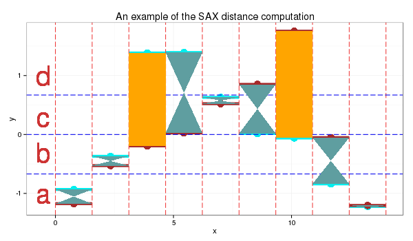

# Symbolic Aggregate Aproximation (_SAX_)
## SAX algorithm implementaion as in:
* ref1
* ref2
* [Symbolic Aggregate approXimation.](https://jmotif.github.io/sax-vsm_site/morea/algorithm/SAX.html)

## The SAX algorithm converts a time series of continuous values to descrete values
### The algotihms steps are the following:
1. Standardize time series
2. Compute Piecewise Aggregate Aproximation, i.e. split series into equily sized intervals
3. Compute PAA's breakpoints (with respect to values' domain). The number of breakpoints is equal to the number of symbols (descrete values a.k.a vocabulary size) 
4. Convert PAA to symbols

## _sax.py_, convert continuois time series to string:
**_Note_**: although **PAA size** is used on the original **SAX** algorithms the code contains an option that allows one to select a **window size** instead (PAA size is computed based on window size and times series' length).
* The code reads time series from a `csv` file (see _sample100.csv_). It thens stores all the intermediate steps and SAX represention of series in a target directory
* **_Tightness of Lower Bound_** is computed and stored for all pairs (_see references_)
* Moreover, this repo includes ... that are also computed and stored for all pairs

### The example bellow represents the application of the SAX algorithm to two time series, using a PAA size of 9 and a vocabulary of size 4. 
|||
|:-------------------------:|:-------------------------:|
|||
_source_: [Symbolic Aggregate approXimation.](https://jmotif.github.io/sax-vsm_site/morea/algorithm/SAX.html)

## Usage
### The **vocabulary** and **PAA size** are tunable via command line.
### Options
* `-dp`(str) [default `./sample100.csv`] input file path
* `-od` (str) [default `./results`] output directory 
* `-paa` (int) [default `9`] PAA size 
* `-w` (int) [default `0`] window size _overrides `-paa`_
* `-v` (int) [default `4`] vocabulary size

**Example**: get sax representation of series from file _./timeseries.csv_, using a paa size of _13_ and a vocabulary size of _6_. Store in directory _./saxresults_
```bash
python sax.py -dp ./timeseries.csv -paa 13 -v 6 -od ./saxresults 
```

## TODO
- [ ] Implement as class
- [ ] Find optimal vocabulary size and PAA or window size. Use TLB
- [ ] Find motifs
